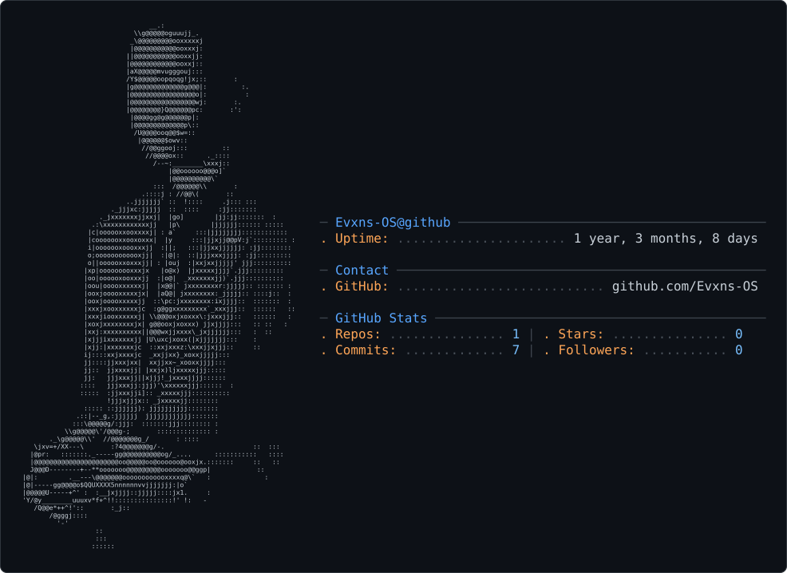

<table>
<tr>
<td width="40%">

<picture>
  <source media="(prefers-color-scheme: dark)" srcset="dark_mode.svg" />
  <source media="(prefers-color-scheme: light)" srcset="light_mode.svg" />
  
</picture>

</td>
<td width="60%">

# Hi, I'm Evans

### Full-Stack Developer · Founder & Solo Engineer at Interllix · Security Analyst in Training

Final-Year Computer Science Student, Federal University Kashere, Nigeria

I design, build, and ship production software end-to-end — from database architecture to deployment — and I'm currently developing a parallel specialization in offensive and defensive security to build systems that are not just functional, but resilient.

</td>
</tr>
</table>

## 🧭 About Me

<table>
<tr>
<td>

> **Final-year CS student** @ Federal University Kashere, Nigeria 🇳🇬  
> **Founder & Solo Engineer** @ Interllix — an edtech SaaS platform built for scale  
> **Security Analyst in Training** — offensive & defensive fundamentals

I take products from **blank schema → live users, real payments, real edge cases.** Production has taught me more than any tutorial: race conditions, access-control bugs, deployment failures — the discipline that separates a demo from something people depend on.

That same instinct is pulling me into **security** — web exploitation, network pentesting, cloud fundamentals — because I don't just want software that *works*. I want software that **holds up under real scrutiny.**

</td>
</tr>
</table>

  
  
  

## GitHub Metrics

